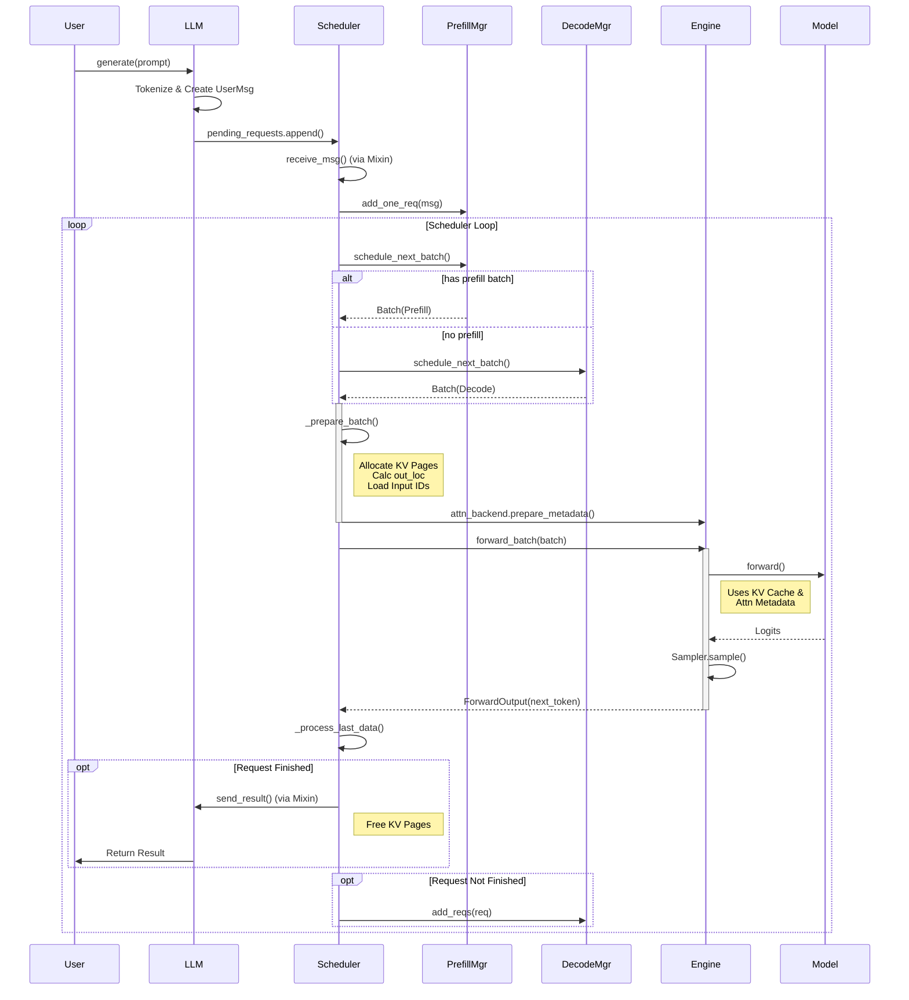

# Mini-SGLang 核心架构：LLM, Scheduler 与 IO 的协同机制

本文档深入解析 Mini-SGLang 中 `llm.py`, `scheduler.py`, `engine.py` 以及 `SchedulerIOMixin` 的核心职责与协作关系。

---

## 1. 宏观架构概览

整个推理系统可以看作一个层级分明的有机体：

1.  **LLM (Facade/Client)**: 最外层接口，面向用户。
2.  **Scheduler (Brain)**: 核心大脑，负责决策、资源分配和调度。
3.  **Engine (Heart/Muscle)**: 执行引擎，负责模型计算和硬件交互。
4.  **SchedulerIOMixin (Mouth/Ears)**: 通信模块，负责数据的输入输出。

**层级关系**:

```text
LLM (inherits Scheduler in offline mode)
 └── Scheduler (inherits SchedulerIOMixin)
      ├── SchedulerIOMixin (Handles ZMQ/Network/Status)
      └── Engine (Handles Model, GPU, Distributed)
           └── Model (PyTorch nn.Module)
```

---

## 2. 组件深度解析

### 2.1 LLM (`llm.py`)

- **角色**: 用户接口 (Facade)。
- **职责**:
  - 提供 `generate()` 等高层 API。
  - 在**离线模式**下，它直接继承并充当 `Scheduler`，通过 `offline_receive_msg` 和 `offline_send_result` 方法拦截网络通信，直接处理本地的 `prompts` 列表。
  - 管理请求状态 (`status_map`)，收集并解码最终生成的 Token。

### 2.2 SchedulerIOMixin (`scheduler/io.py`)

- **角色**: I/O 通信层。
- **职责**:
  - 这是一个 Mixin 类，混入到 `Scheduler` 中。
  - 管理 ZMQ 队列 (Pull/Push, Pub/Sub)。
  - **接收 (Receive)**: 从 Tokenizer 或前端接收 `UserMsg`。
  - **回复 (Reply)**: 将生成的 `DetokenizeMsg` 发回前端。
  - **同步**: 在多卡 (Tensor Parallel) 模式下，负责将主 Rank 收到的请求广播给其他 Rank。

### 2.3 Engine (`engine/engine.py`)

- **Documentation**: [`my_docs/engine_architecture.md`](engine_architecture.md) (Deep dive)
- **角色**: 计算执行者。
- **职责**:
  - **硬件管理**: 初始化 NCCL 分布式环境，管理 GPU Stream。
  - **模型持有**: 加载权重，持有 `model` 实例。
  - **底层资源**: 创建 `kv_cache` 物理存储，初始化 `attn_backend` (FlashAttention/FlashInfer)。
  - **Forward**: 执行 `forward_batch(batch)`，调用模型进行一次前向传播，并不关心请求的具体逻辑，只管算。

### 2.4 Scheduler (`scheduler/scheduler.py`)

- **角色**: 核心调度器。
- **职责**:
  - **资源管理**: 拥有 `CacheManager` (管理 KV Cache 页) 和 `TableManager` (管理 Token Pool)。
  - **队列管理**: 维护 `prefill_manager` (新请求) 和 `decode_manager` (正在生成的请求)。
  - **调度决策**: 在 `_schedule_next_batch` 中决定下一轮是做 Prefill 还是 Decode，挑选哪些请求上车。
  - **元数据准备**: 在 `_prepare_batch` 中计算 `out_loc`，分配 KV 页表，生成 Attention Metadata。

---

## 3. 核心资源的协调流程

### 3.1 资源的持有者

- **KV Cache (显存)**:
  - 物理存储 (`kv_cache` Tensor) 在 **Engine** 中。
  - 逻辑分配 (哪一页给谁) 由 **Scheduler** 的 `CacheManager` 管理。
- **Attention Metadata**:
  - 由 **Engine** 的 `attn_backend` 定义格式。
  - 由 **Scheduler** 在每一步计算前动态生成填入 `Batch` 对象。
- **Tokens**:
  - **Scheduler** 维护一个巨大的 `token_pool` (在 CPU/GPU 上)，用于存放所有请求的历史 Token ID。

### 3.2 典型生命周期 (Life of a Request)

#### 第一阶段：提交与接收

1.  **用户**调用 `llm.generate(prompt)`.
2.  **LLM** 将 Prompt Tokenize，包装成 `UserMsg`，放入 `pending_requests`.
3.  **Scheduler** (通过 `SchedulerIOMixin`) 调用 `receive_msg` 拉取这些请求。
4.  请求被放入 **Scheduler** 的 `prefill_manager` 等待队列。

#### 第二阶段：调度与资源分配 (Scheduler 主导)

1.  **Scheduler** 运行 `_schedule_next_batch`:
    - 优先检查 `prefill_manager`。如果显存足够，取出请求进行 Prefill。
    - 否则检查 `decode_manager`，取出上一轮未完成的请求进行 Decode。
2.  **Scheduler** 运行 `_prepare_batch`:
    - **KV Cache**: 调用 `cache_manager.allocate` 为当前 Batch 分配所需的显存页。
    - **Page Table**: 更新页表，记录逻辑 Token 到物理页的映射。
    - **Input**: 从 `token_pool` 加载需要的 Input IDs 到 Batch 中。
    - **Attention**: 调用 `engine.attn_backend.prepare_metadata` 生成元数据。

#### 第三阶段：计算执行 (Engine 主导)

1.  **Scheduler** 调用 `engine.forward_batch(batch)`.
2.  **Engine**:
    - 设置全局上下文。
    - 调用 `model.forward()`。模型内部利用 `attn_metadata` 和 `kv_cache` 进行自注意力计算。
    - 执行采样 (`Sampler`)，得到 `next_token`。
3.  **Engine** 返回 `ForwardOutput` (包含 GPU 上的 next token 和 CPU 上的副本)。

#### 第四阶段：后处理与循环

1.  **Scheduler** 处理结果 (`_process_last_data`):
    - 将生成的 `next_token` 写回 `token_pool`。
    - 检查是否结束 (EOS 或 Max Length)。
    - **未结束**: 将请求加入 `decode_manager`，下一轮继续调度。
    - **已结束**: 释放 KV Cache 页 (`cache_manager.free`)，通过 `SchedulerIOMixin` 发送最终结果。

### 3.3 时序图：请求处理全流程



---

## 4. 总结：如何协调？

| 资源/动作          | Scheduler 的工作 (大脑)            | Engine 的工作 (肌肉)             |
| :----------------- | :--------------------------------- | :------------------------------- |
| **KV Cache**       | 决定“哪个请求用哪几页”，记账       | 实际持有显存 Tensor，提供读写    |
| **Attention**      | 准备“谁看谁”的元数据 (Metadata)    | 执行实际的矩阵运算 (FlashAttn)   |
| **Prefill/Decode** | 决定“这一轮跑什么模式”，组装 Batch | 盲目执行 Forward，不关心模式差异 |
| **Token 流转**     | 维护 Token Pool，更新历史记录      | 采样生成 Next Token              |

这种分离设计使得 **Scheduler** 可以专注于复杂的调度策略（如 Continuous Batching, PagedAttention 内存管理），而 **Engine** 专注于高性能的计算内核执行，两者通过 `Batch` 对象进行解耦通信。

---

## 5. 关键方法详解 (Deep Dive)

本节深入剖析 Scheduler 中四个最关键的方法，它们构成了推理循环的核心骨架。

### 5.1 `prefill_manager.add_one_req(msg)`

- **触发时机**: 当 Scheduler 通过 `_process_one_msg` 收到一个新的用户请求时。
- **核心逻辑**:
  1.  **对象化**: 将原始的 `UserMsg` 转换为内部的 `Req` 对象。
  2.  **Slot 分配**: 调用 `table_manager.allocate()` 获取一个唯一的 `table_idx` (Slot ID)。
  3.  **Token 写入**: 立即将用户输入的 Prompt Token IDs 写入到 GPU/CPU 上的 `token_pool` 中对应的 Slot 行。这是为了后续 GPU 能够快速读取。
  4.  **入队**: 将新创建的 `Req` 对象放入 `waiting_queue`，等待下一次调度。

### 5.2 `scheduler._schedule_next_batch()`

- **触发时机**: 在每一轮主循环开始，准备决定“接下来做什么”时。
- **核心逻辑 (优先级策略)**:
  1.  **优先 Prefill**: 首先询问 `prefill_manager.schedule_next_batch(budget)`。
      - 如果有排队的请求且显存足够，它会根据 Token 预算 (Budget) 尽可能多地打包新请求，生成一个 `phase="prefill"` 的 Batch。
  2.  **次选 Decode**: 如果没有 Prefill 任务，或者显存不足以开启新请求，则询问 `decode_manager.schedule_next_batch()`。
      - 它会取出所有正在运行 (Running) 的请求，生成一个 `phase="decode"` 的 Batch。
  - **返回**: 一个逻辑上的 `Batch` 对象（只包含请求列表，尚未分配物理资源）。

### 5.3 `scheduler._prepare_batch(batch)`

- **触发时机**: 在 `_schedule_next_batch` 选定请求之后，在 GPU 执行之前。
- **核心逻辑 (物理映射)**:
  - 这是一个**模式无关 (Phase-Agnostic)** 的过程。它不关心是 Prefill 还是 Decode，只关心“这个请求需要计算多少新 Token (`extend_len`)”。
  1.  **显存分配**: 计算当前 Batch 总共需要多少新 KV Cache 页，调用 `cache_manager.allocate()` 批量申请。
  2.  **页表更新**: 将申请到的物理页号写入 GPU 上的 `page_table`。
  3.  **计算索引**:
      - `out_loc`: 计算每个请求输出结果在 Flatten 数组中的位置。
      - `load_indices`: 计算需要从 `token_pool` 读取哪些 Token 作为 Input。
  4.  **元数据生成**: 调用 `engine.attn_backend.prepare_metadata()`，生成给 Attention Kernel 用的复杂结构体。
  - **返回**: 包含物理索引和元数据的 `ForwardInput`。

### 5.4 `scheduler._process_last_data(last_data)`

- **触发时机**: 当 GPU 完成上一轮 Forward 计算，且数据已拷贝回 CPU 后。
- **核心逻辑 (状态流转)**:
  1.  **回填 Token**: 遍历 Batch 中的每个请求，将生成的 `next_token` (CPU 侧) 追加到 `Req.input_ids` 中。
  2.  **写入 Pool**: 将 `next_token` (GPU 侧) 写入 `token_pool`，供下一轮使用。
  3.  **结束判定**:
      - 检查是否遇到 EOS Token。
      - 检查是否达到最大长度 (`max_device_len`)。
  4.  **分支处理**:
      - **如果结束**: 调用 `cache_manager.free()` 释放 Slot 和 KV 页；通过 I/O 发送最终结果。
      - **如果未结束**: 将请求对象重新加入 `decode_manager`，它将在下一轮调度中继续参与 Decode。
