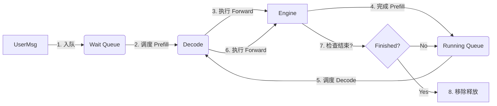

# Continuous Batching Logic Analysis

本文档详细解析 Mini-SGLang 中 **Continuous Batching** (连续批处理，也称为 Iteration-Level Scheduling) 的实现逻辑。

## 1. 核心概念

传统的批处理 (Static Batching) 需要等待批次中所有请求都完成后才能开始下一批，导致“短请求等待长请求”，GPU 利用率低。

**Continuous Batching** 的核心思想是：

- **按迭代调度 (Iteration-Level)**: 调度器不再以“整个请求生命周期”为单位，而是以“单次 Forward”为单位进行调度。
- **动态插入与移除**:
  - 当一个请求生成了 EOS (结束符)，立即释放其资源。
  - 当有空闲资源时，立即插入新的请求进行 Prefill。
  - 正在生成的请求 (Decode) 和新来的请求 (Prefill) 在时间轴上交替或并行处理。

在 Mini-SGLang 中，这一机制主要由 `Scheduler` 协调 `PrefillManager` 和 `DecodeManager` 来实现。

---

## 2. 架构组件

### 2.1 Scheduler (`scheduler.py`)

总指挥。它的 `overlap_loop` 每一轮都会调用 `_schedule_next_batch()` 来决定这一步做什么。

### 2.2 PrefillManager (`prefill.py`)

- **职责**: 管理等待队列 (`pending_list`)。
- **逻辑**: 维护一个待处理的 `UserMsg` 列表。
- **Chunked Prefill**: 如果一个 Prompt 太长，超过了单次计算预算 (`token_budget`)，它会将请求切分为多个 `ChunkedReq`。只有最后一个 Chunk 执行完后，请求才会进入 Decode 阶段。这避免了长 Prompt 阻塞整个系统太久。

### 2.3 DecodeManager (`decode.py`)

- **职责**: 管理活跃队列 (`running_reqs`)。
- **逻辑**: 维护所有已经完成 Prefill、正在逐个生成 Token 的请求。
- **调度**: 通常非常简单——只要显存允许，所有活跃请求在每一轮都会被调度执行一次 (生成 1 个 Token)。

---

## 3. 请求生命周期与状态流转



### 详细步骤

1.  **提交 (Submission)**:
    - 用户发送请求，`Scheduler` 接收并通过 `prefill_manager.add_one_req()` 将其封装为 `PendingReq` 放入等待队列。

2.  **调度决策 (Scheduling Decision)**:
    - `_schedule_next_batch()` 执行。
    - **优先 Prefill**: 默认策略是优先处理新请求 (或是分块的继续)。如果 `PrefillManager` 有任务且显存/Budget 允许，创建一个 `Batch(phase="prefill")`。
    - **否则 Decode**: 如果没有 Prefill 任务，或者显存紧张，则从 `DecodeManager` 抓取所有活跃请求，创建一个 `Batch(phase="decode")`。
    - _(注: Mini-SGLang 目前采用 Prefill/Decode 阶段分离的策略，即同一时刻要么做 Prefill 要么做 Decode，这简化了显存管理和算子调用，但逻辑上通过快速切换实现了 Continuous Batching)_

3.  **执行 (Execution)**:
    - `Engine` 执行模型 Forward。
    - 对于 Prefill，计算整个 Prompt 的 KV Cache。
    - 对于 Decode，利用 KV Cache 生成下一个 Token。

4.  **状态更新 (State Transition)**:
    - **Prefill -> Decode**: `scheduler._forward` 执行完后，调用 `decode_manager.add_reqs(batch.reqs)`。这意味着刚才还在 Prefill 的请求，现在正式成为“正在生成中”的请求。
      - _特例_: `ChunkedReq` 如果没处理完，不会进入 DecodeManager，而是回到 PrefillManager 的队头。
    - **Decode 循环**: Decode 请求在每一轮 Loop 中被取出，执行一次，然后通过 `req.complete_one()` 更新长度。
    - **完成退出**: `_process_last_data` 检查 `req.remain_len <= 0` 或 `EOS`。如果满足，调用 `decode_manager.remove_req(req)` 并释放显存。

---

## 4. 关键代码逻辑

### 调度循环 (`scheduler.py`)

```python
def _schedule_next_batch(self) -> ForwardInput | None:
    # 策略：优先 Prefill，其次 Decode
    # 这里的 prefill_budget 控制一次处理多少 Token，防止卡顿
    batch = (
        self.prefill_manager.schedule_next_batch(self.prefill_budget)
        or self.decode_manager.schedule_next_batch()
    )
    return self._prepare_batch(batch) if batch else None
```

### 动态批次构建 (`prefill.py`)

`PrefillManager` 使用 `PrefillAdder` 来“贪婪”地填充 Batch：

```python
class PrefillAdder:
    def try_add_one(self, pending_req):
        # 1. 检查 Token 预算 (token_budget)
        # 2. 检查显存容量 (cache_manager.available_size)
        # 3. 预留 Decode 空间 (reserved_size) 防止死锁
        # 如果通过，则分配 PageTable 索引，加入 Batch
```

### 活跃请求管理 (`decode.py`)

`DecodeManager` 相对简单，它持有一个 `Set[Req]`：

```python
class DecodeManager:
    def schedule_next_batch(self):
        # 将所有活跃请求打包
        # 因为是迭代级调度，所以这里总是取全量（除非实现更复杂的抢占逻辑）
        return Batch(reqs=list(self.running_reqs), phase="decode")
```

---

## 5. 总结

Mini-SGLang 实现了 Continuous Batching 的核心要素：

1.  **细粒度调度**: 每次只跑一步，跑完重新洗牌。
2.  **动态进出**: 随时接纳新请求 (Prefill)，随时剔除完成的请求。
3.  **显存感知**: `PrefillManager` 在接纳新请求前会严格计算显存，确保系统不会 OOM (Out Of Memory)。
4.  **Chunked Prefill**: 支持长文本切分，进一步平滑了系统负载。

这种机制保证了 GPU 始终处于忙碌状态，且延迟对于短请求更加友好，是现代 LLM 推理引擎（如 vLLM, SGLang, TGI）的标准配置。
