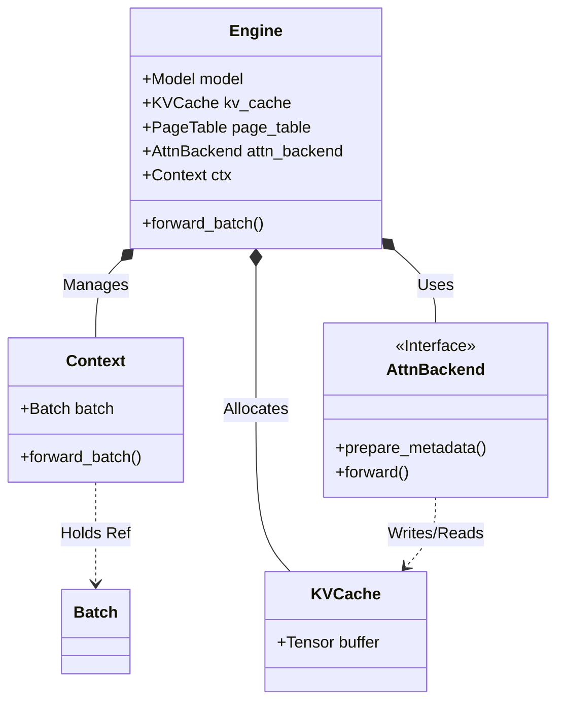

# Engine Architecture & Execution Flow

This document details the internal architecture of the `Engine` class in `mini-sglang`. The Engine is the "muscle" of the system, responsible for model initialization, memory management (VRAM), and executing the actual neural network forward passes.

## 1. High-Level Responsibilities

The `Engine` (`python/minisgl/engine/engine.py`) encapsulates all GPU-related complexities:
*   **Hardware Abstraction**: Manages CUDA streams, devices, and distributed process groups.
*   **Resource Management**: Allocates the KV Cache and Page Tables based on available VRAM.
*   **Model Execution**: Loads the LLM weights and runs the `forward()` pass.
*   **State Tracking**: Updates request status (e.g., increments `device_len`) after each step.

## 2. Configuration (`EngineConfig`)

The engine is configured via `EngineConfig` (defined in `python/minisgl/engine/config.py`). This configuration is typically derived from `ServerArgs` or explicitly created for tests.

| Parameter | Description |
| :--- | :--- |
| `model_path` | Path to the HF model or repo ID. |
| `tp_info` | Tensor Parallel rank and world size. |
| `max_running_req` | Maximum number of concurrent requests (determines Page Table size). |
| `memory_ratio` | Fraction of VRAM to reserve for KV Cache (default 0.9). |
| `attention_backend` | Choice of kernel: `"naive"`, `"flashinfer"`, etc. |
| `page_size` | Number of tokens per KV cache page (Block Size). |

## 3. Initialization Sequence

The `__init__` method follows a strict sequence to ensure safe startup, especially in distributed environments.

### 3.1 Distributed Environment Setup
*   **Function**: `_init_communication`
*   **Logic**:
    *   If `world_size == 1` or `use_pynccl`: Initializes `gloo` as the control plane.
    *   If `world_size > 1`: Initializes `nccl` for high-performance GPU-to-GPU communication.
    *   **PyNCCL**: If enabled, it bypasses standard Torch distributed for raw pointer-based communication, often faster for small tensor operations common in inference.

### 3.2 Model Loading
*   **Device**: Weights are initially loaded on CPU to save GPU memory during the loading phase.
*   **Precision**: Weights are converted to the target `dtype` (fp16/bf16) before moving to GPU.
*   **Dummy Weights**: For performance testing without downloading 20GB+ files, `use_dummy_weight=True` initializes random tensors directly on the GPU.

### 3.3 Memory Management & KV Cache Allocation
This is the most critical step for maximizing throughput.

1.  **Measure**: The engine measures available VRAM (`_sync_get_memory`).
2.  **Calculate**: It uses `_determine_num_pages` to find how many KV pages fit in the remaining memory.
    $$ \text{Available} = (\text{Total} \times \text{Ratio}) - \text{ModelWeights} $$
    $$ \text{NumPages} = \frac{\text{Available}}{\text{PageSize} \times \text{Layers} \times \text{Heads} \times \text{HeadDim} \times \text{Bytes}} $$
3.  **Allocate**: Calls `create_kvcache` to allocate the massive 5D Tensor for the pool.

### 3.4 Page Table Creation
*   A 2D Int32 Tensor of shape `[max_running_req + 1, max_seq_len]`.
*   The `+ 1` is for a "Dummy Request" used for padding or CUDA Graph capture.
*   This table maps logical slots to physical KV page indices.

## 4. The Global Context Mechanism

To avoid passing `batch`, `attn_metadata`, and `page_table` through every single layer of the PyTorch model (which would require rewriting the entire model definition), MiniSGL uses a **Global Context** pattern.

*   **Class**: `Context` in `python/minisgl/core.py`.
*   **Mechanism**:
    1.  Engine initializes `self.ctx` and calls `set_global_ctx(self.ctx)`.
    2.  During `forward_batch`, the Engine uses a context manager:
        ```python
        with self.ctx.forward_batch(batch):
            logits = self.model.forward()
        ```
    3.  Inside the model (e.g., `Attention` layer):
        ```python
        ctx = get_global_ctx()
        batch = ctx.batch
        # Access metadata directly
        ```
*   **Analogy**: This is similar to Flask's `request` object or React's `useContext`.

## 5. Execution Flow: `forward_batch`

The `forward_batch` method is the entry point for the Scheduler to run a step.

### Inputs
*   **`batch`**: The logical batch object containing requests.
*   **`args`**: Sampling arguments (`BatchSamplingArgs`).

### Process
1.  **Set Context**: Activates the global context for this batch.
2.  **Model Forward**: Calls `self.model.forward()`.
    *   The model layers use `get_global_ctx()` to find input IDs, position embeddings, and attention metadata.
    *   The model writes K/V pairs to the `kv_cache` (managed by the Attention Backend).
3.  **Update State**: Iterates through `batch.reqs` and calls `req.complete_one()`.
    *   Updates `cached_len` (e.g., 10 -> 11).
    *   Updates `device_len`.
4.  **Sampling**:
    *   Takes the `logits` from the model.
    *   Uses `self.sampler` (Argmax, Top-K, Top-P) to generate `next_token_ids`.
5.  **Output**: Returns `ForwardOutput`.
    *   **GPU Tensor**: For the next step's input (keeps data on GPU).
    *   **CPU Tensor**: For the Scheduler's logic (EOS check, detokenization).

## 6. Attention Backends

The Engine delegates the complex math of attention to a backend.

*   **Interface**: `BaseAttnBackend`
*   **Implementations**:
    *   `NaiveBackend`: Pure PyTorch implementation (slow, for debugging/CPU).
    *   `FlashInferBackend`: Uses FlashInfer kernels (SOTA speed).
    *   `FlashAttnBackend`: Uses FlashAttention-2.
*   **Responsibility**:
    *   **Metadata**: Prepares complex index structures (`cu_seqlens`, `block_tables`).
    *   **Forward**: Runs the actual CUDA kernel for `prefill` or `decode`.

## 7. Diagram: Engine Components


