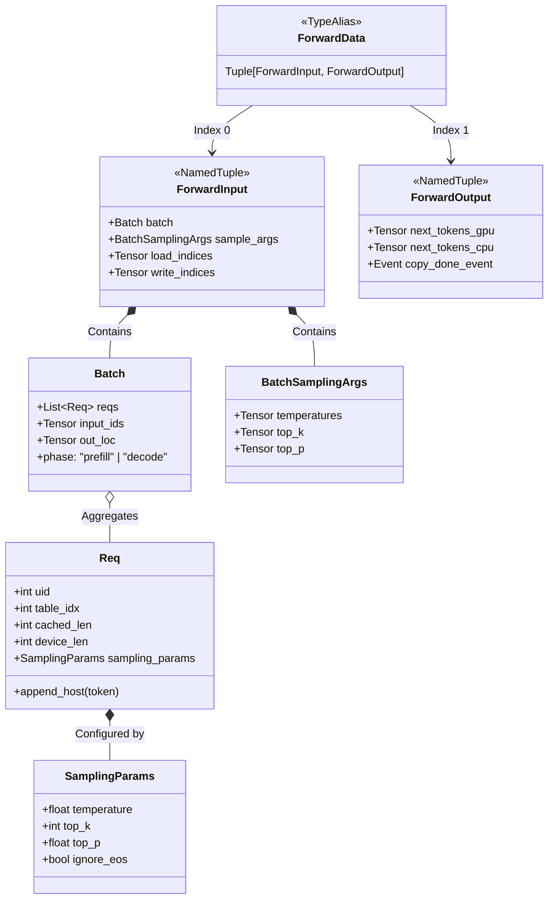
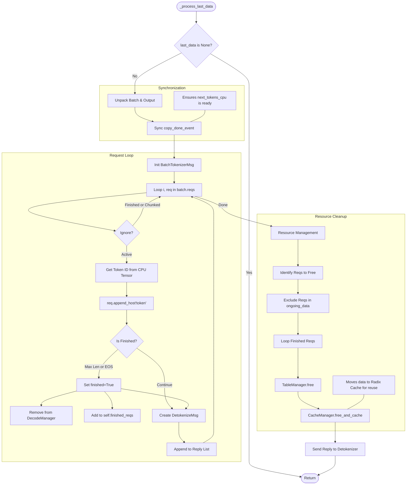

# ForwardData Analysis & Process Logic

This document provides a deep dive into the `ForwardData` type and the `_process_last_data` method within the Mini-SGLang scheduler. These components are critical for the pipelined execution model (Overlap Scheduling).

## 1. ForwardData Class Architecture

`ForwardData` acts as the "state object" passed between iterations of the scheduler loop. It encapsulates everything needed to track a batch of requests that has been submitted to the GPU but whose results are processed in the next CPU cycle.

### 1.1 Class Diagram

The following diagram illustrates the composition of `ForwardData` and its dependencies.



### 1.2 Component Definitions

- **`ForwardData` (`scheduler.py`)**: A simple `Tuple` holding the input sent to the GPU and the output handle received from it.
- **`ForwardInput` (`scheduler.py`)**: Prepared on the CPU.
  - `load_indices`: 1D tensor used to gather tokens from the KV cache pool for the model input.
  - `write_indices`: 1D tensor specifying where the generated _next_ tokens should be written back into the KV cache pool.
- **`ForwardOutput` (`engine.py`)**: Returned by the Engine.
  - `next_tokens_cpu`: The crucial tensor for logic. It is a CPU copy of the generated tokens, allowing the scheduler to inspect results without blocking the GPU.
  - `copy_done_event`: A CUDA event that signals when the `GPU -> CPU` copy of token IDs is complete.

---

## 2. \_process_last_data Logic Analysis

The `_process_last_data` method is the **Consumer** in the producer-consumer pipeline. It runs on the CPU while the GPU is busy computing the _next_ batch (`ongoing_data`).

### 2.1 Responsibilities

1.  **Synchronization**: Ensures the CPU has received the token IDs generated by the GPU.
2.  **State Update**: Appends new tokens to request objects (`Req`).
3.  **Termination Check**: Determines if requests have finished (EOS token or Max Length).
4.  **Communication**: Sends generation results back to the Detokenizer/User.
5.  **Resource Management**: Frees memory (Page Table & KV Cache) for finished requests.

### 2.2 Logic Flowchart



### 2.3 Critical Details

#### Synchronization Point

```python
if copy_done:
    copy_done.synchronize()
```

This is a "soft" synchronization. It only waits for the tiny data transfer (Token IDs) to finish, not the entire GPU computation. This allows the CPU to process results ASAP.

#### Safety Mechanism: `ongoing_data`

```python
ongoing_reqs = ongoing_data[0].batch.reqs if ongoing_data else []
for req in self.finished_reqs.difference(ongoing_reqs):
    # Free resources...
```

This check prevents a race condition. It is possible for a request to be marked as "finished" (e.g., hit max length) in `last_data`, but simultaneously be included in `ongoing_data` (the batch currently running on GPU) if the scheduler logic didn't catch it in time or if it's a multi-step process. This filter ensures we don't free the memory of a request that the GPU is currently reading/writing.

#### Radix Cache Integration

When a request finishes:

```python
self.cache_manager.free_and_cache_finished_req(...)
```

Instead of simply discarding the KV cache, the system attempts to insert the token sequence into the `RadixCache`. This allows future requests with the same prefix to reuse the computed KV states (Prefix Caching).

---

## 3. Model Integration: The Lifecycle of Token IDs (Example: Qwen)

The efficiency of Mini-SGLang comes from how `ForwardData` structures are consumed by the model architecture without unnecessary data movement. Using **Qwen3** as an example, here is the lifecycle:

### 3.1 Data Consumption (The "Pull" Model)

The model does not "receive" arguments in the traditional sense. Instead, it "pulls" what it needs from the **Global Context** established by the `Engine`.

1.  **Input IDs**: `Qwen3ForCausalLM.forward()` calls `get_global_ctx().batch.input_ids`. This is the flattened 1D tensor prepared by the Scheduler using `load_indices`.
2.  **Attention Metadata**: Inside `AttentionLayer.forward()`, the model retrieves `metadata = ctx.batch.attn_metadata`. This contains `positions` for RoPE and block tables for PagedAttention.

### 3.2 Computational Steps

| Component | Action | Role of ForwardData |
| :--- | :--- | :--- |
| **Embedding** | `VocabParallelEmbedding` | Maps `input_ids` to hidden states. |
| **Rotary (RoPE)** | `get_rope().forward()` | Uses `metadata.positions` to rotate Q and K vectors. |
| **Attention** | `attn_backend.forward()` | Uses `batch.out_loc` to write new K/V values into the global KV pool at the exact physical indices allocated by the Scheduler. |
| **LM Head** | `ParallelLMHead` | Computes Logits. **Optimization**: For Prefill, it only computes Logits for the last token of each sequence (using `attn_metadata.get_last_indices`). |

### 3.3 Result Generation (Sampling)

Once `model.forward()` returns the raw Logits, the `Engine` takes over:

1.  **Slicing**: The Engine slices the Logits tensor to include only the relevant tokens (one per request).
2.  **Sampling**: The `Sampler` uses `BatchSamplingArgs` (from `ForwardInput`) to perform Top-P/Top-K/Temperature sampling on the GPU.
3.  **Output Packaging**: The resulting `next_tokens_gpu` and its CPU clone `next_tokens_cpu` are wrapped into a `ForwardOutput` object.

### 3.4 Closing the Loop

The Scheduler then calls `_write_token_ids(input, output)`, which executes:
`token_pool.view(-1)[input.write_indices] = output.next_tokens_gpu`

This ensures that the GPU-resident "Source of Truth" (`token_pool`) is updated for the next iteration, while the CPU-resident `next_tokens_cpu` is used in `_process_last_data` to inform the user and update the `Req` objects.
