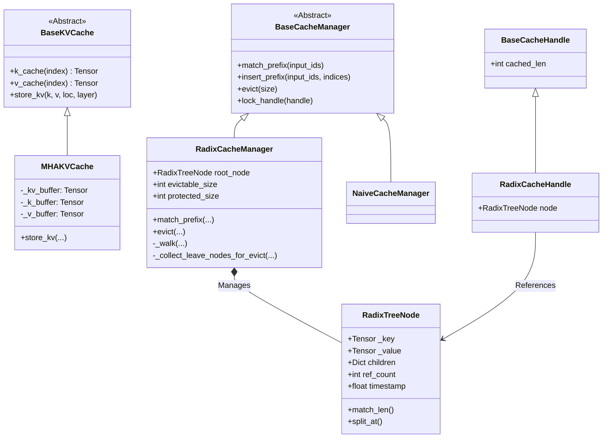
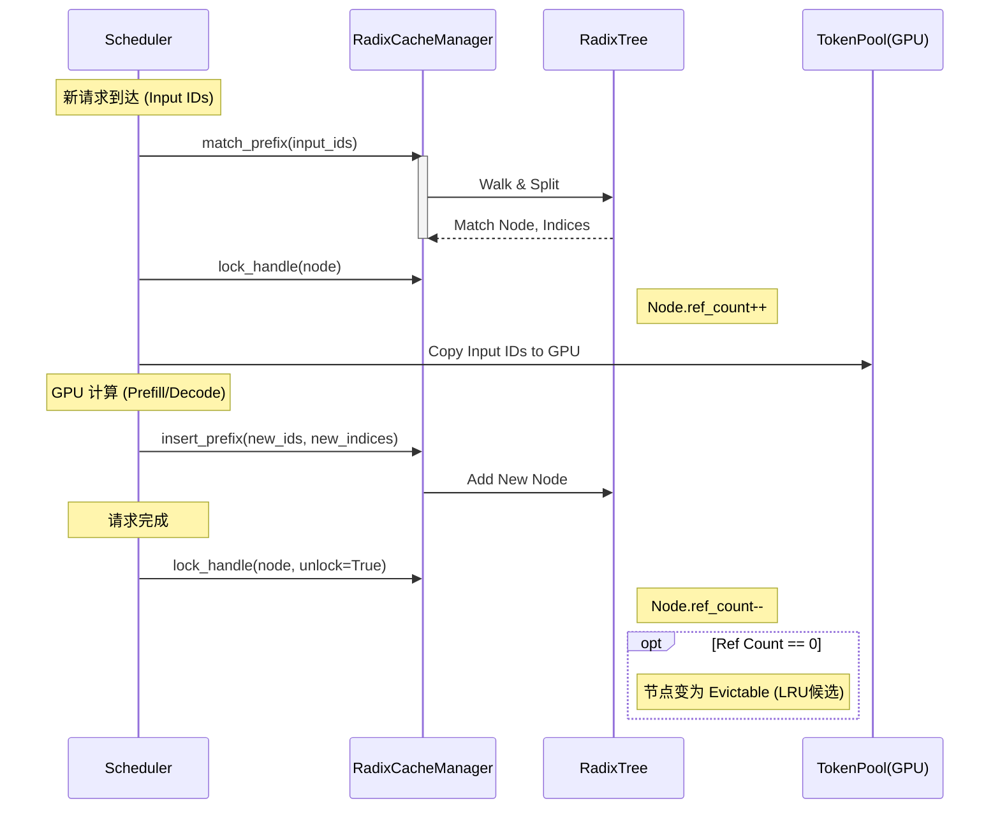

# KV Cache 架构设计分析

本文档详细分析了 `python/minisgl/kvcache` 模块的设计。该模块负责管理 LLM 推理过程中的 Key-Value Cache（KV 缓存），实现了物理存储与逻辑管理的分离，并利用 Radix Tree（基数树）实现了高效的前缀缓存复用。

## 1. 架构概览

Mini-SGLang 的 KV Cache 设计采用了 **物理存储与逻辑管理分离** 的模式：

1.  **物理层 (`BaseKVCache` / `MHAKVCache`)**：
    - 负责在 GPU 显存中申请巨大的 Tensor 用于存储 KV 数据。
    - 不关心数据属于哪个请求，只关心物理索引（Page Index 或 Slot Index）。
    - 负责执行实际的 `store_kv` 操作。

2.  **逻辑层 (`BaseCacheManager` / `RadixCacheManager`)**：
    - 负责维护 Token ID 到 物理索引 的映射关系。
    - 负责显存分配（Allocation）和回收（Free）。
    - 实现了 **Radix Tree** 算法，用于前缀匹配和复用。
    - 实现了 **LRU (Least Recently Used)** 驱逐策略。

## 2. 类图结构 (Class Diagram)



## 3. 核心组件详解

### 3.1 物理存储：MHAKVCache (`mha_pool.py`)

这是一个巨大的显存池。

- **内存布局**：支持 `LayerFirst` 或 `PageFirst`。通常为了计算效率，会将 tensor view 调整为 `(layer, page, head, head_dim)`。
- **预分配**：初始化时根据 `num_pages` 直接分配整个显存块，避免运行时的内存碎片和分配开销。
- **写入机制**：`store_kv` 方法调用底层的 CUDA Kernel (`store_cache`)，将计算出的 Key/Value 根据 `out_loc`（页表索引）写入到指定位置。

### 3.2 逻辑核心：RadixCacheManager (`radix_manager.py`)

这是实现 Shared Prefix Caching（共享前缀缓存）的大脑。它维护了一棵 **基数树 (Radix Tree)**。

#### 3.2.1 Radix Tree Node 结构

每个节点 (`RadixTreeNode`) 代表一段连续的 Token 序列。

- **Key**: Token IDs 序列 (例如 `[101, 200, 300]`)。
- **Value**: 对应的物理显存索引 (例如 `[5, 9, 12]`)。
- **Children**: 子节点映射 `Token ID -> Node`。
- **Ref Count**: 引用计数。`>0` 表示当前有请求正在使用该节点（受保护），`=0` 表示可被驱逐。
- **Timestamp**: 最后一次访问时间，用于 LRU 驱逐。

#### 3.2.2 核心操作逻辑

**A. 前缀匹配 (`match_prefix`)**
当新请求到来时，Manager 会在树上行走，寻找最长的匹配路径。

1.  从 Root 开始，根据 Input IDs 查找子节点。
2.  进入节点，比较 Input IDs 与节点的 Key。
3.  **分裂 (Split)**：如果节点的 Key 只有前一部分匹配（例如 Key 是 `[A, B, C]`，输入是 `[A, B, D]`），则将该节点分裂为父节点 `[A, B]` 和子节点 `[C]`，然后返回父节点作为匹配结果。
4.  返回匹配到的最后一个节点句柄，以及路径上所有的物理索引。

**B. 插入前缀 (`insert_prefix`)**
当请求计算出新的 KV Cache 后，将其插入树中。

- 如果完全匹配现有路径，则不操作。
- 如果有新生成的 Token，创建新的子节点挂载到树上，并存入对应的物理索引。

**C. 显存驱逐 (`evict`)**
当显存不足时，需要释放空间。策略是 **LRU (Least Recently Used)**。

1.  **收集叶子**：遍历树，找到所有 `ref_count == 0` 且是叶子节点（没有子节点）的节点。
2.  **堆排序**：将叶子节点放入小顶堆（按时间戳排序）。
3.  **循环弹出**：
    - 弹出最老的节点。
    - 释放其占用的物理索引（回收给 `TableManager`）。
    - 从父节点断开连接。
    - **级联检查**：如果父节点因此变成了新的叶子节点且 `ref_count == 0`，将父节点加入堆中继续等待驱逐。

### 3.3 内存池管理与映射 (Pool Management)

Mini-SGLang 使用两级映射机制来管理显存池，确保了“物理上连续分配，逻辑上按需组合”。

#### 3.3.1 物理 Token Pool

`MHAKVCache` 在初始化时分配了一个巨大的 5D Tensor：
`[2, num_layers, num_pages, 1, num_kv_heads, head_dim]`

- **Token Pool**: 这里虽然名字里有 "Pool"，但实际上在物理层，每个 "Page" 只包含 **1 个 Token** (假设 `page_size=1`)。
- 这使得物理索引 (`index`) 直接对应显存中的偏移量。

#### 3.3.2 页表 (Page Table)

在 `Engine` 和 `Scheduler` 中维护了一个 `page_table`（Tensor）。
`page_table` 的形状是 `[max_running_req, max_seq_len]`。

- **作用**：它实现了 **虚拟地址 (Request ID + Token Position)** 到 **物理地址 (Pool Index)** 的映射。
- **写入**：当 `RadixCacheManager` 分配或复用了 indices 后，这些 indices 会被拷贝到 `page_table` 中。
- **读取**：Attention Kernel (如 FlashInfer) 直接读取这个 `page_table` 来知道去哪里取 KV 数据。

#### 3.3.3 交互流程

1.  **分配**：`TableManager.allocate()` 从空闲列表中拿出一个 `table_idx`（行号）。
2.  **映射**：`PrefillAdder` 从 `RadixManager` 拿到复用的物理 indices，填入 `page_table[table_idx]`。
3.  **计算**：Attention Kernel 根据 `page_table` 读取显存池。
4.  **回收**：请求结束后，`TableManager.free(table_idx)` 释放行号；同时 `RadixManager` 将物理 indices 标记为可驱逐（ref_count--），等待将来可能的 LRU 回收。

## 4. 逻辑流程图 (Flowchart)

### 4.1 请求处理生命周期

展示了一个请求如何与 Cache Manager 交互。



### 4.2 LRU 驱逐逻辑

```mermaid
flowchart TD
    Start([Evict Request: size N]) --> Collect[Collect Leaf Nodes<br/>(ref_count == 0)]
    Collect --> Heapify[Build Min-Heap by Timestamp]

    Heapify --> CheckSize{Evicted >= N?}
    CheckSize -- Yes --> Return[Return Indices]
    CheckSize -- No --> Pop[Pop Oldest Node]

    Pop --> Free[Free Indices]
    Pop --> Detach[Detach from Parent]

    Detach --> CheckParent{Parent is Leaf &<br/>ref_count == 0?}
    CheckParent -- Yes --> PushParent[Push Parent to Heap]
    CheckParent -- No --> CheckSize

    PushParent --> CheckSize
```

## 5. 总结

`python/minisgl/kvcache` 模块通过以下关键设计实现了高性能推理：

1.  **预分配大内存池** (`MHAKVCache`)：消除运行时的显存分配抖动。
2.  **Radix Tree 索引** (`RadixCacheManager`)：
    - **极致复用**：不仅复用 System Prompt，还能复用多轮对话的历史 (History) 和 Few-shot 示例。
    - **动态分裂**：通过节点分裂机制，自适应地处理不同请求的公共前缀。
3.  **引用计数与 LRU**：精确管理显存生命周期，确保正在使用的缓存不被删除，同时最大化利用空闲显存缓存历史数据。

