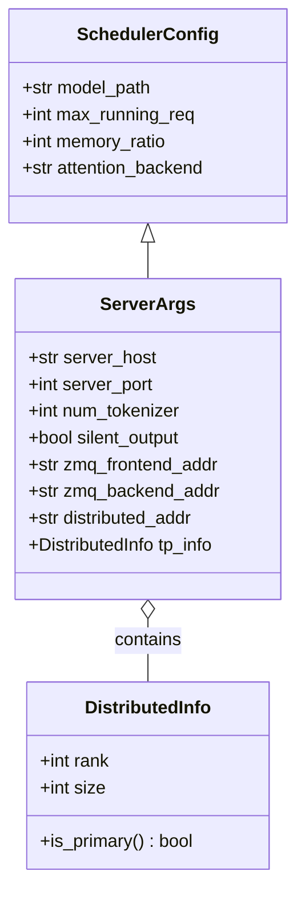
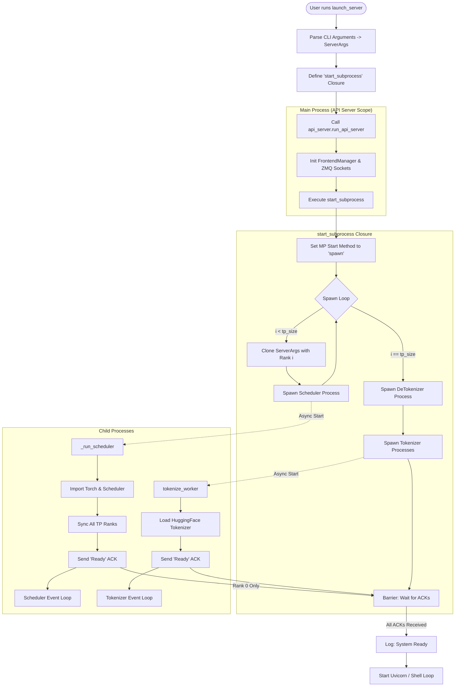

# Analysis of `python/minisgl/server/launch.py`

This document provides a detailed analysis of the server launch mechanism in MiniSGL. It covers the initialization flow, process management, and the core data structures that orchestrate the distributed inference system.

## 1. Overview

The `launch.py` script is the entry point for the MiniSGL backend. Its primary responsibility is to bootstrap the multi-process architecture required for high-performance LLM inference.

It moves from a single Python process (Main) to a coordinated cluster of processes:

1.  **Main Process**: API Server / Shell (User Interface).
2.  **Scheduler Processes**: One per GPU (Tensor Parallelism) for model execution.
3.  **Tokenizer/DeTokenizer Processes**: CPU-bound processes for text processing.

## 2. Core Data Models

The launch process relies heavily on two immutable data structures to ensure configuration consistency across processes.

### 2.1 Class Diagram



### 2.2 Model Details

- **`ServerArgs` (Frozen Dataclass)**:
  - This is the "Single Source of Truth". It is parsed once in the Main process and passed to all child processes.
  - It calculates critical ZMQ IPC addresses (e.g., `ipc:///tmp/minisgl_3...`) to ensure all processes connect to the correct sockets.
  - It contains a `tp_info` field.

- **`DistributedInfo`**:
  - **Role**: Defines the identity of a specific process within the parallel compute cluster.
  - **Attributes**:
    - `rank`: The ID of the current process (0 to N-1).
    - `size`: Total number of parallel processes (N).
  - **Usage**: In `launch.py`, `dataclasses.replace` is used to create a unique `ServerArgs` instance for each Scheduler process, injecting a specific `DistributedInfo(rank=i, size=N)`.

## 3. Launch Control Flow

The launch process is intricate because it involves callbacks and synchronization barriers to prevent race conditions (e.g., preventing the API from accepting requests before the GPU is ready).

### 3.1 Flowchart



## 4. Detailed Step-by-Step Analysis

### Step 1: Argument Parsing

- **Location**: `launch_server` entry.
- **Action**: `parse_args(sys.argv)` creates the base `ServerArgs`.
- **Details**: It resolves defaults (e.g., `dtype=auto`) and expands file paths.

### Step 2: The `start_subprocess` Closure

- **Concept**: Instead of spawning processes immediately, `launch.py` defines a function `start_subprocess`.
- **Why?**: This function is passed to the API Server. The API Server must create its ZMQ sockets _first_ (so they exist for children to connect to), and _then_ call this function to start the workers.

### Step 3: Process Spawning (The "Spawn" method)

- **Code**: `mp.set_start_method("spawn", force=True)`
- **Critical Detail**: In Python + CUDA, you _cannot_ use the default Linux `fork`. Forking copies the parent's memory, including initialized CUDA contexts, which crashes PyTorch. `spawn` creates a fresh interpreter.

### Step 4: Identity Injection (The `replace` trick)

- **Code**:
  ```python
  new_args = replace(server_args, tp_info=DistributedInfo(i, world_size))
  ```
- **Mechanism**: The Scheduler logic is identical for all GPUs. The `tp_info` injected here is the only thing that tells a process "You are GPU 0" vs "You are GPU 1".

### Step 5: The Synchronization Barrier

- **Mechanism**: `ack_queue = mp.Queue()`
- **Action**: The main process blocks on a loop:
  ```python
  for _ in range(num_tokenizers + 2):
      logger.info(ack_queue.get())
  ```
- **Logic**: It waits for:
  1.  Rank 0 Scheduler (Primary) to say "Model Ready".
  2.  DeTokenizer to say "Ready".
  3.  All Tokenizers to say "Ready".
- **Result**: The HTTP server (`uvicorn`) does not start binding to the port until the backend is fully capable of serving requests.

### Step 6: `_run_scheduler` (The Backend)

- **Delayed Imports**: Imports `torch` and `minisgl.scheduler` _inside_ the function. This prevents the main process from accidentally loading CUDA libraries before spawning.
- **`scheduler.sync_all_ranks()`**: Uses PyNCCL (NVIDIA Collective Communications Library) to ensure all GPU processes have successfully initialized and can talk to each other before proceeding.
