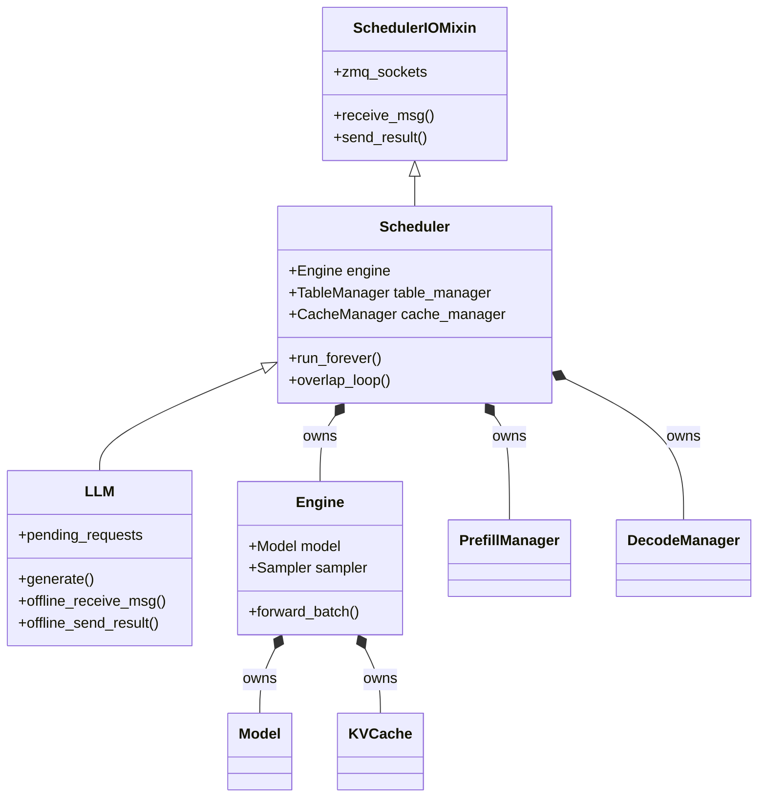
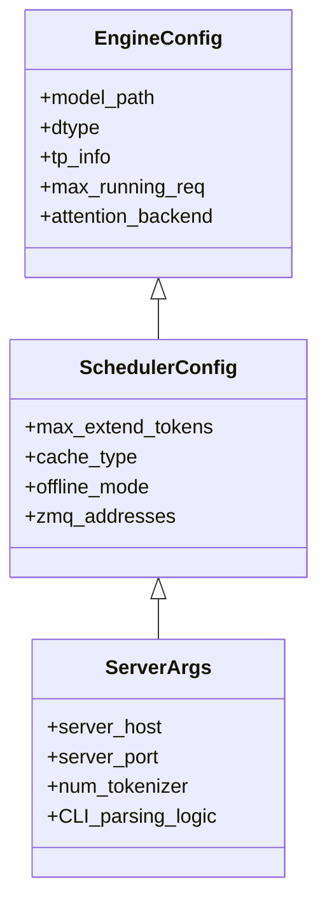

# LLM Class Architecture & Configuration Flow

This document details the architecture of the `LLM` class in `mini-sglang`, its inheritance hierarchy, and how configuration parameters propagate through the system.

## 1. Class Architecture

The `mini-sglang` architecture uses a mix of **Inheritance** (for specialized behaviors like Offline vs. Server modes) and **Composition** (for separating responsibilities like Scheduling vs. Computation).

### High-Level Hierarchy (Mermaid)



### Component Breakdown

1.  **`LLM` (`python/minisgl/llm/llm.py`)**
    *   **Role:** The high-level user entry point for **offline inference** (running locally in a Python script).
    *   **Inheritance:** Inherits from `Scheduler`.
    *   **Key Behavior:** It overrides `receive_msg` and `send_result` to bypass ZMQ networking and instead interact directly with a local `pending_requests` list and `status_map`.

2.  **`Scheduler` (`python/minisgl/scheduler/scheduler.py`)**
    *   **Role:** The "Brain" of the system. It orchestrates memory, batching, and execution.
    *   **Inheritance:** Inherits from `SchedulerIOMixin` (which handles ZMQ setup).
    *   **Key Behavior:** Manages the main event loop (`run_forever`), decides which requests to run (`schedule_next_batch`), and coordinates the `Engine`.

3.  **`Engine` (`python/minisgl/engine/engine.py`)**
    *   **Role:** The "Muscle" or "Worker".
    *   **Inheritance:** Standalone class.
    *   **Key Behavior:** Manages the GPU context, loads the Model weights, allocates KV Cache on VRAM, and executes the actual `model.forward()`.

---

## 2. Configuration Flow

Configuration in `mini-sglang` follows a strict inheritance chain using Python `dataclasses`.

### Configuration Hierarchy (Mermaid)



### Data Flow Analysis

When you initialize `LLM` or start the server, arguments flow as follows:

1.  **Input:** User provides arguments (e.g., `model_path="meta-llama/Llama-2-7b"`, `dtype="float16"`).
2.  **Construction:**
    *   **In `LLM.__init__`:** A `SchedulerConfig` object is created.
        ```python
        config = SchedulerConfig(
            model_path=...,
            offline_mode=True,  # Forced for LLM class
            ...
        )
        ```
    *   **In `server/launch.py` (CLI):** `parse_args()` creates a `ServerArgs` object (which is a subclass of `SchedulerConfig`).
3.  **Propagation:**
    *   `LLM` passes `config` to `super().__init__(config)` (the `Scheduler`).
    *   `Scheduler` takes `config` and initializes `self.engine = Engine(config)`.
    *   `Engine` takes `config` (as `EngineConfig`) and uses it to load weights, set up NCCL, etc.

### Key Configuration Classes

*   **`EngineConfig` (`python/minisgl/engine/config.py`)**:
    *   Base configuration containing hardware and model execution settings (Dtype, Tensor Parallelism, Memory Ratio).
*   **`SchedulerConfig` (`python/minisgl/scheduler/config.py`)**:
    *   Extends `EngineConfig`. Adds scheduling-specific settings (Radix Cache type, Chunk Prefill size, ZMQ IPC addresses).
*   **`ServerArgs` (`python/minisgl/server/args.py`)**:
    *   Extends `SchedulerConfig`. Adds network server settings (Host, Port) and handles CLI argument parsing.

## 3. Summary for Developers

If you want to add a new configuration parameter:

1.  **Define it:** Add the field to `EngineConfig` (if it affects model/compute) or `SchedulerConfig` (if it affects batching/network).
2.  **Expose it:** If it needs to be set via CLI, add the argument to `parse_args` in `python/minisgl/server/args.py`.
3.  **Use it:** Access it via `self.config.your_param` in `Engine` or `Scheduler`.
