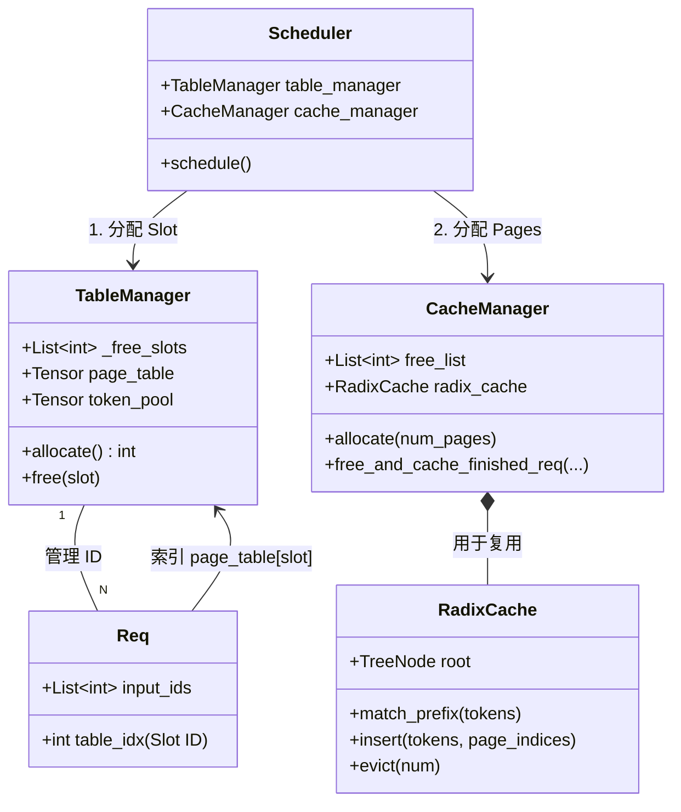
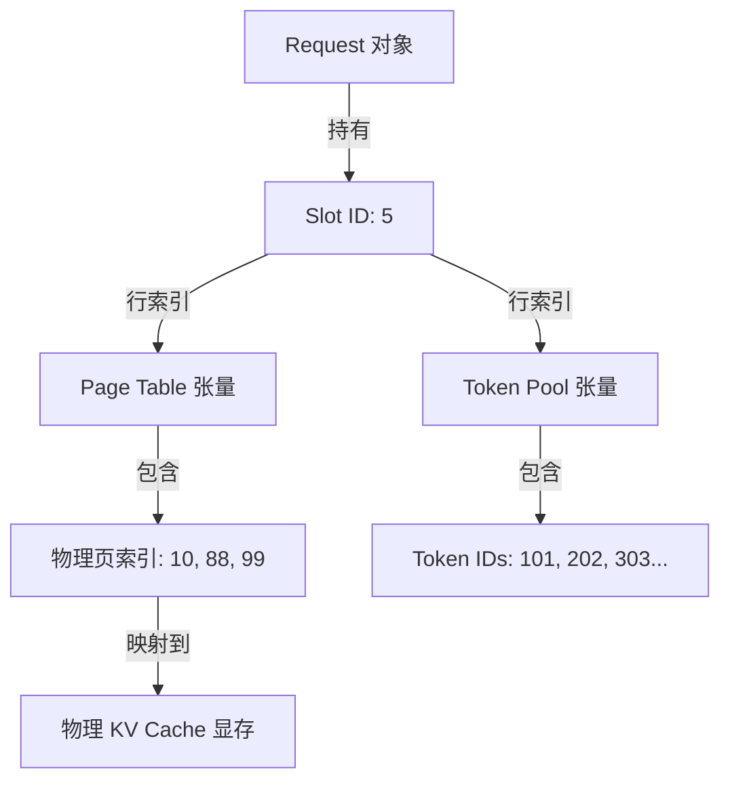
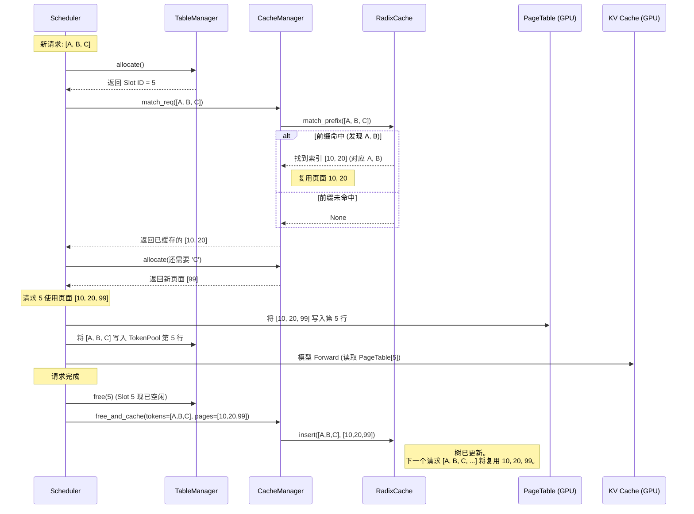
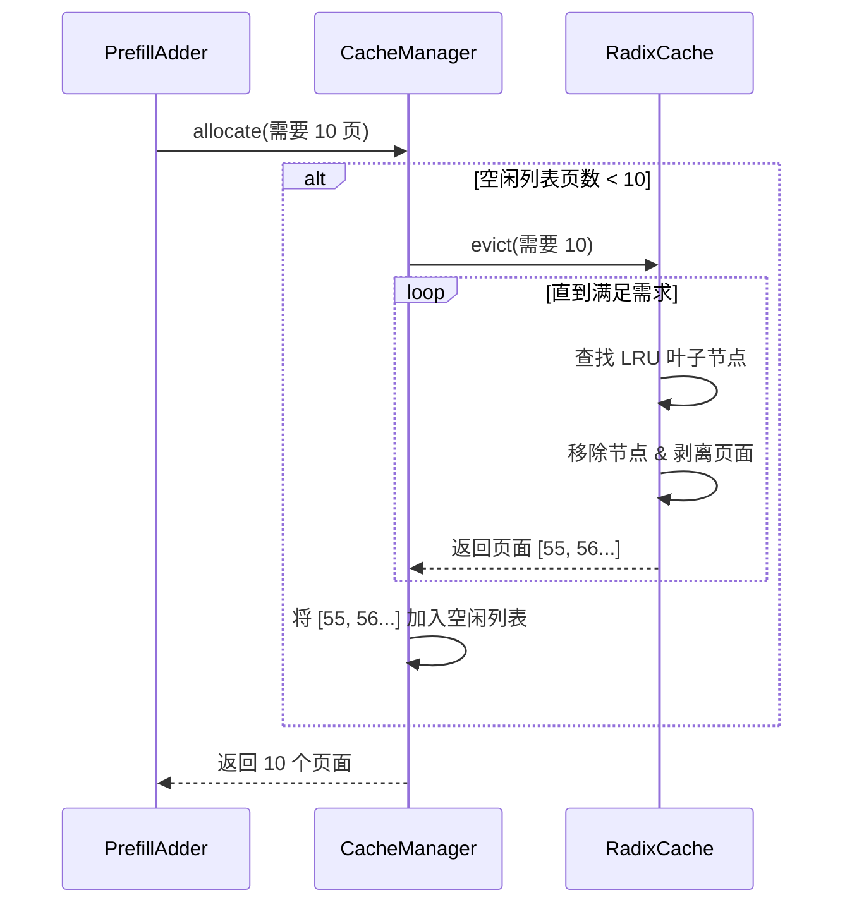

# 显存管理机制：Slots, Tables, 和 Radix Cache

本文档汇总了 `mini-sglang` 中显存管理的分析，重点关注 `TableManager`、`CacheManager`、`RadixCache` 之间的交互，以及 `page_table` 和 `token_pool` 等核心数据结构。

## 1. 核心概念与术语

要理解系统如何管理并发请求的 GPU 显存，我们必须区分“逻辑资源”（Slots）和“物理资源”（Pages）。

### 1.1 Slot (槽位)

- **定义**：分配给正在运行的请求的逻辑标识符（整数）。
- **范围**：`[0, max_running_reqs - 1]`。
- **作用**：作为全局元数据张量（`page_table`、`token_pool`）的 **行索引 (Row Index)**。
- **生命周期**：请求开始时分配，执行期间持有，请求结束时释放。

### 1.2 Page Table (页表)

- **定义**：GPU 上的 2D Tensor，形状为 `[max_running_reqs, max_seq_len]`。
- **结构**：
  - **行 (Row)**：对应一个 **Slot**。
  - **值 (Value)**：存储 **物理页索引 (Physical Page Index)**。这是一个整数，代表该 Token 在物理 KV Cache 池中的“门牌号”。
- **示例**：`page_table[slot_id][:seq_len]` 返回一个整数列表（例如 `[10, 25, 99]`），这就是该请求的 **物理页列表**。

### 1.3 Token Pool (Token 池)

...

- **核心作用**：
  - **历史记录**：它是所有活跃请求 Token 历史的“总账本”。
  - **快速加载**：在每一步 Forward 前，Scheduler 不需要重新从 CPU 内存（`Req` 对象）拷贝大量数据，而是通过索引（`load_indices`）直接从 `token_pool` 中提取出本次需要的 Token ID，极大地减少了 Host-to-Device 的数据传输开销。

### 1.4 KV Cache (Key-Value Cache)

...

- **PagedAttention 支持**：通过分页管理（而非连续内存分配），彻底解决了显存碎片化问题，允许灵活的动态扩展。

### 1.5 物理页 (Physical Page) —— 到底存了什么？

当我们说“物理页列表 `[10, 25, 99]`”时，这些数字是 **KV Cache 池 (MHAKVCache)** 这一巨大张量的索引。

- **本质**：物理页是显存中一块固定大小的区域，用于存放 **一个或多个 Token 在模型所有层中对应的 Key 和 Value 向量**。
- **存储内容**：
  - **Key 向量**：该 Token 在 Layer 0, Layer 1, ..., Layer N 的所有 K。
  - **Value 向量**：该 Token 在 Layer 0, Layer 1, ..., Layer N 的所有 V。
- **数据结构映射**：
  - 假设物理页索引为 `idx`。
  - 它对应 `MHAKVCache` 中 `pages` 维度的第 `idx` 个槽位。
  - 模型在第 `L` 层计算时，会根据 `page_table` 找到 `idx`，然后读写 `K_cache[L, idx, ...]` 和 `V_cache[L, idx, ...]`。
- **Mini-SGLang 的特殊点**：
  - 在当前实现中，`page_size` 通常设为 **1**。
  - 这意味着 **1 个物理页 = 1 个 Token 的全层 KV 数据**。
  - 物理页列表 `[10, 25, 99]` 就代表了这个请求的第 1, 2, 3 个 Token 分别存放在显存池的第 10, 25, 99 号槽位。

---

## 2. 架构与关系

下图展示了这些组件如何交互。

### 2.1 组件关系图



### 2.2 "Slot" 桥梁 (概念视图)

**Slot** 是连接 Request 对象与其 GPU 资源的中心枢纽。



---

## 3. 工作流分析

### 3.1 分配与执行流程

此时序图跟踪一个新请求 `[A, B, C]` 进入系统的过程。

1.  **Slot 分配**：请求获得 Slot `5`。
2.  **显存查找**：系统检查 `[A, B]` 是否之前出现过。
3.  **映射**：物理页号写入 `page_table` 的第 `5` 行。
4.  **回收**：请求结束时，页面被发送到 `RadixCache` 而不是直接销毁。



### 3.2 Radix Cache 与驱逐 (Eviction) 流程

当显存已满时，`CacheManager` 和 `RadixCache` 如何协作。



### 3.3 深入解析：Token Pool 的生命周期与变化

`token_pool` 是显存中一份关于“我是谁，我之前说了什么”的完整档案。它的内容随着请求的推进而不断演变。

#### 阶段 1：初始化与 Slot 分配

当一个新的请求 (`Req A`, Slot `5`) 到达时：

- `token_pool` 的第 `5` 行处于未定义状态（脏数据）。
- `req.table_idx` 被设置为 `5`，建立了逻辑关联。

#### 阶段 2：Prefill (预填充) —— 批量写入

在第一次推理前（Prefill 阶段）：

- **动作**：系统将 `Req A` 的完整 Prompt `[How, are, you]` 一次性写入 `token_pool`。
- **操作**：使用 `token_pool[5, :3] = [How, are, you]`。
- **此时状态**：第 5 行的前 3 个位置被填充，其余位置无效。

#### 阶段 3：Forward 准备 —— 提取 Input

在每一轮模型计算前（`Scheduler._prepare_batch`）：

- **问题**：模型只需要本次的输入。Prefill 时是 Prompt，Decode 时是上一个词。
- **操作**：系统生成 `load_indices`。
  - 如果是 Prefill，索引指向 Slot 5 的 `0, 1, 2` 位置。
  - 如果是 Decode (假设已生成 10 个词)，索引指向 Slot 5 的 `10` 位置。
- **提取**：`batch.input_ids = token_pool[load_indices]`。这是极其高效的 GPU 内部拷贝。

#### 阶段 4：Decode (解码) —— 增量写入

模型生成了下一个 Token (例如 `Good`)：

- **动作**：将新生成的 Token 直接写回池中，无需 CPU 参与。
- **如何做到？**：
  1.  **预计算索引**：在 Forward 之前，Scheduler 已经在 CPU 上计算好了 `write_indices`（指向每个请求在 Token Pool 中的下一个空白位置）并传给 GPU。
  2.  **GPU 闭环**：模型输出 Logits -> GPU 采样得到 Token ID -> GPU 根据 `write_indices` 直接将 ID 写入 `token_pool` 显存。
  3.  **优势**：避免了 "GPU -> CPU -> CPU append -> GPU" 的昂贵数据往返，实现了 Zero-Copy 的状态更新。
- **操作**：`token_pool[5, 3] = Good` (在 GPU 上执行)。
- **此时状态**：第 5 行的有效长度增加到了 4。下一轮 Decode 将会去读这个位置作为输入。

#### 阶段 5：释放

当请求结束时：

- **动作**：`TableManager.free(5)`。
- **结果**：Slot 5 被标记为空闲。`token_pool` 第 5 行的数据**不会被立即清空**，它们只是变成了“无效数据”。等到下一个新请求复用 Slot 5 时，这些旧数据会被直接覆盖。

#### 总结对比：Token Pool vs Batch.input_ids

- **`token_pool`**: **持久化存储**。存在于整个请求生命周期，记录完整历史。它是数据源。
- **`Batch.input_ids`**: **临时变量**。只存在于单次 Forward 计算中，是真正喂给模型的“一维切片”。它通常是从 `token_pool` 中拷贝出来的子集。

---

## 4. KV Cache 深度解析：作用与流程

KV Cache 是推理引擎中占用显存最大、管理最复杂的资源。它贯穿了从请求开始到结束的每一毫秒。

### 4.1 为什么需要 KV Cache？

在 Transformer 的 Self-Attention 机制中，当前 Token 需要与之前所有 Token 进行交互（点积运算）。

- **没有 Cache**: 生成第 100 个词时，必须重新计算前 99 个词的 K/V 向量。复杂度是 $O(n^2)$。
- **有 Cache**: 前 99 个词的 K/V 已经存在显存里了，只需要计算第 100 个词的 K/V，然后读取旧数据进行交互。复杂度降为 $O(n)$。

### 4.2 涉及的核心流程

#### 1. 分配 (Allocation)

- **触发者**: `Scheduler._prepare_batch`
- **动作**: `CacheManager` 从空闲列表中弹出物理页索引 (例如 `[10, 25]`)。
- **记录**: 这些索引被填入 `page_table` 的对应 Slot 行。此时，显存中的这几块区域归该请求独占。

#### 2. 写入 (Write / Append)

- **触发者**: `Model.forward` -> `Attention Layer`
- **动作**:
  - **Prefill**: 模型并行计算 Prompt 中所有 Token 的 K/V，并通过 PagedAttention Kernel 写入到分配的物理页中。
  - **Decode**: 模型计算最新生成 Token 的 K/V，写入到当前物理页的下一个空闲位置。如果当前页满了，Scheduler 会在下一轮分配新页。

#### 3. 读取 (Read / Attention)

- **触发者**: `Model.forward` -> `Attention Layer`
- **动作**: PagedAttention Kernel 根据 `page_table` 提供的物理地址，从不连续的显存页中读取之前所有 Token 的 K/V 向量，与当前的 Query (Q) 向量进行运算，得出 Attention Score。

#### 4. 回收与复用 (Recycle)

- **触发者**: 请求结束或被抢占。
- **动作**: 物理页索引被归还。
  - 如果开启了 **RadixCache**，这些页不会立即清空，而是挂在树节点上等待“命中”。
  - 只有当显存极度紧张需要驱逐时，这些页的数据才会被认为是无效的，并被重新分配给完全不相关的请求。

---

## 5. 关键总结

1.  **Slot $\neq$ 物理内存**：Slot 只是一个目录条目。它通过 Page Table 指向物理内存。
2.  **Page Table 是 2D 的**：它映射 `(Request, Logical_Pos)` -> `Physical_Page`。
3.  **Token Pool 镜像了 Page Table**：它映射 `(Request, Logical_Pos)` -> `Token_ID`。
4.  **Radix Cache 维护状态**：物理页很少被传统意义上的“释放”。它们在“活跃请求” -> “Radix 树 (缓存)” -> “空闲列表 (被驱逐)” -> “活跃请求” 之间流转。
5.  **KV Cache 是时空权衡**：用大量的显存空间（存储历史）换取极致的计算时间（避免重算）。

```

```
