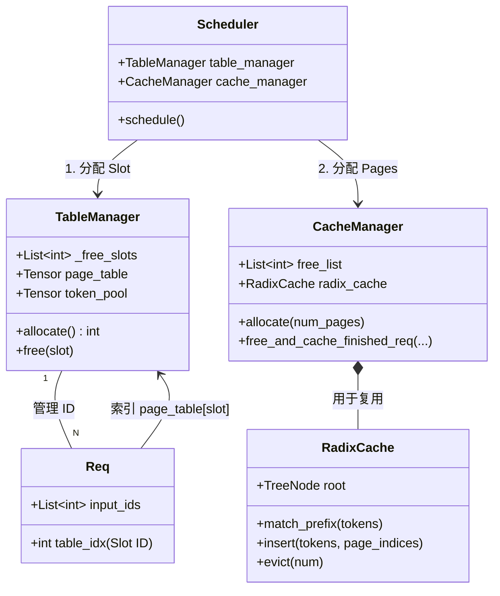
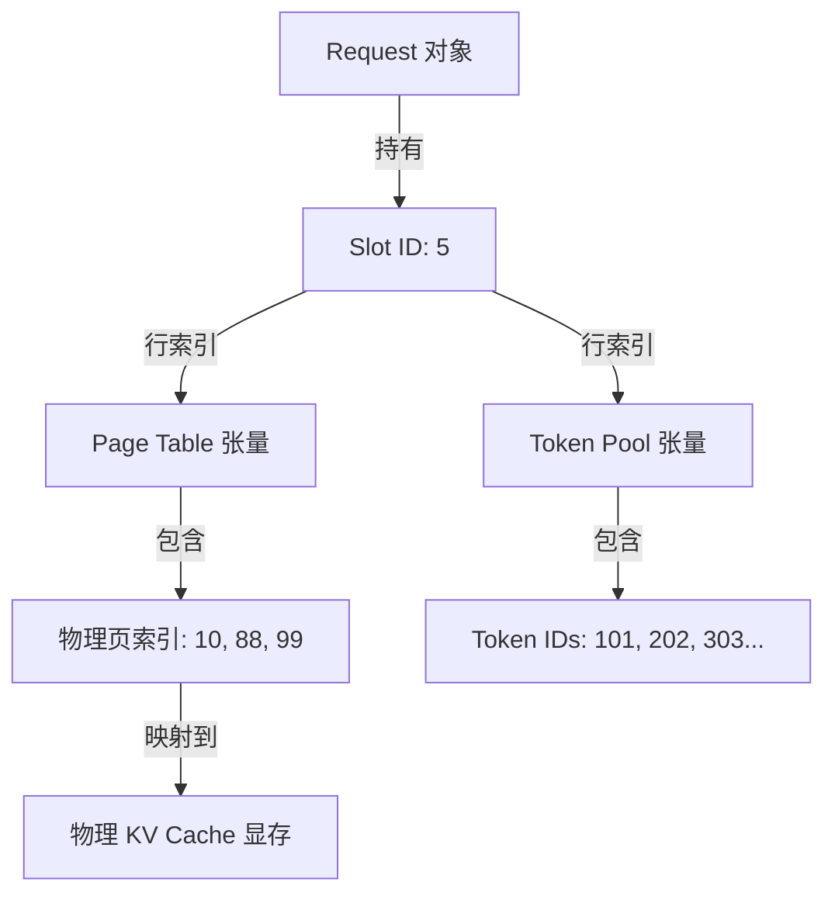
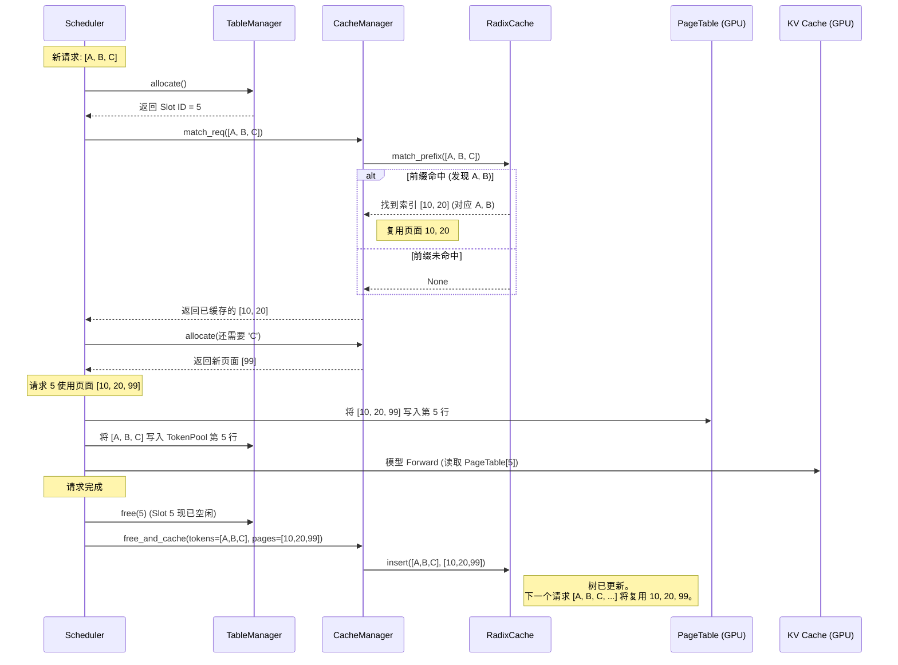
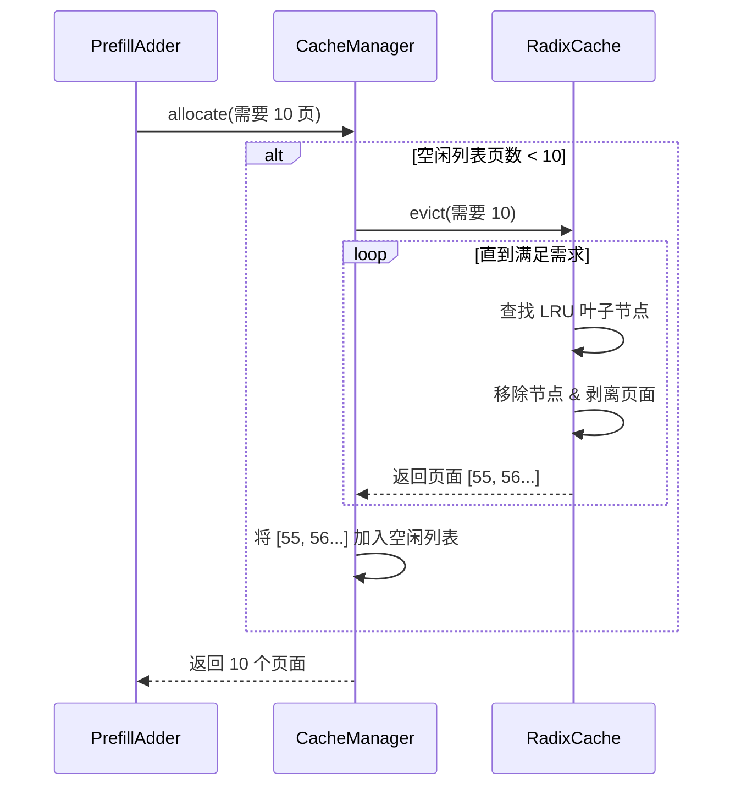

# 显存管理机制：Slots, Tables, 和 Radix Cache

本文档汇总了 `mini-sglang` 中显存管理的分析，重点关注 `TableManager`、`CacheManager`、`RadixCache` 之间的交互，以及 `page_table` 和 `token_pool` 等核心数据结构。

## 1. 核心概念与术语

要理解系统如何管理并发请求的 GPU 显存，我们必须区分“逻辑资源”（Slots）和“物理资源”（Pages）。

### 1.1 Slot (槽位)

- **定义**：分配给正在运行的请求的逻辑标识符（整数）。
- **范围**：`[0, max_running_reqs - 1]`。
- **作用**：作为全局元数据张量（`page_table`、`token_pool`）的 **行索引 (Row Index)**。
- **生命周期**：请求开始时分配，执行期间持有，请求结束时释放。

### 1.2 Page Table (页表)

- **定义**：GPU 上的 2D Tensor，形状为 `[max_running_reqs, max_seq_len]`。
- **结构**：
  - **行 (Row)**：对应一个 **Slot**。
  - **值 (Value)**：存储 **物理页索引 (Physical Page Indices)**。
- **示例**：`page_table[slot_id][:cached_len]` 返回该请求 KV 数据存储的物理页列表。

### 1.3 Token Pool (Token 池)

- **定义**：GPU 上的 2D Tensor，形状与 `page_table` 相同。
- **结构**：
  - **行 (Row)**：对应一个 **Slot**。
  - **值 (Value)**：存储实际的 **Token IDs**（整数）。
- **目的**：允许 GPU kernel 通过 Slot ID 以合并访问（coalesced access）的方式读取所有活跃请求的输入 token。

### 1.4 Physical Page (物理页 / KV Cache 块)

- **定义**：全局 `kv_cache` 张量中的一块连续内存。
- **标识符**：`Page Index` (例如 55)。
- **容量**：存储固定数量 token 的 KV 对（由 `page_size` 定义）。
- **映射**：`Physical Page 55` -> `kv_cache[..., 55, ...]`.

---

## 2. 架构与关系

下图展示了这些组件如何交互。

### 2.1 组件关系图



### 2.2 "Slot" 桥梁 (概念视图)

**Slot** 是连接 Request 对象与其 GPU 资源的中心枢纽。



---

## 3. 工作流分析

### 3.1 分配与执行流程

此时序图跟踪一个新请求 `[A, B, C]` 进入系统的过程。

1.  **Slot 分配**：请求获得 Slot `5`。
2.  **显存查找**：系统检查 `[A, B]` 是否之前出现过。
3.  **映射**：物理页号写入 `page_table` 的第 `5` 行。
4.  **回收**：请求结束时，页面被发送到 `RadixCache` 而不是直接销毁。



### 3.2 Radix Cache 与驱逐 (Eviction) 流程

当显存已满时，`CacheManager` 和 `RadixCache` 如何协作。



## 4. 关键总结

1.  **Slot $\neq$ 物理内存**：Slot 只是一个目录条目。它通过 Page Table 指向物理内存。
2.  **Page Table 是 2D 的**：它映射 `(Request, Logical_Pos)` -> `Physical_Page`。
3.  **Token Pool 镜像了 Page Table**：它映射 `(Request, Logical_Pos)` -> `Token_ID`。
4.  **Radix Cache 维护状态**：物理页很少被传统意义上的“释放”。它们在“活跃请求” -> “Radix 树 (缓存)” -> “空闲列表 (被驱逐)” -> “活跃请求” 之间流转。

```

```

