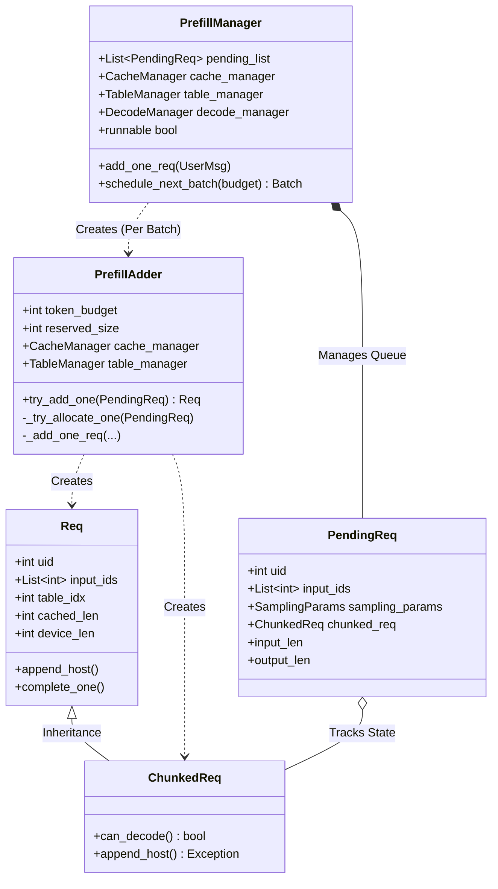
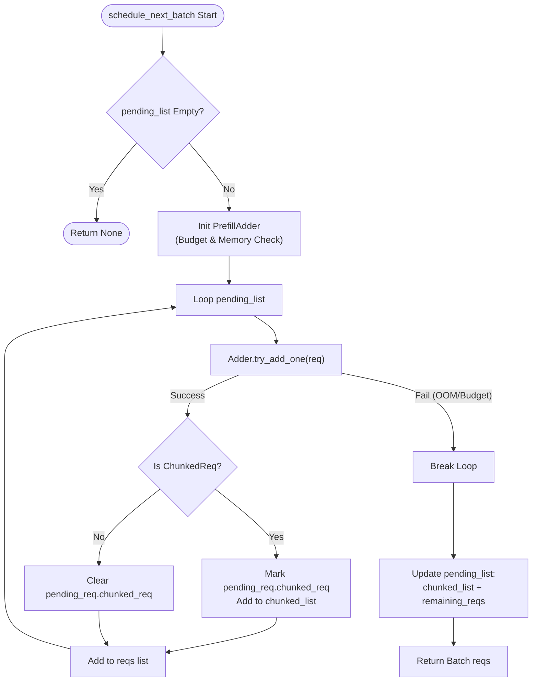

# Prefill Manager Architecture

This document details the architecture of the Prefill Scheduler in `python/minisgl/scheduler/prefill.py`. This component handles the initial processing of user prompts (Prefill phase), managing memory allocation, batching, and chunked execution for long contexts.

## 1. Class Diagram (Mermaid)

## 2. Scheduling Flowchart

The following flowchart describes the logic within `PrefillManager.schedule_next_batch`, which decides which requests enter the GPU for the next forward pass.

## 3. Key Concepts

### 3.1 PendingReq vs. Req

- **`PendingReq`**: Represents a raw user request waiting in the `pending_list`. It holds the full input data and tracks progress if chunking is needed.
- **`Req`**: Represents an _active_ request scheduled for the _current_ GPU batch. It is lightweight and tied to specific GPU resources (Table Index, Cache Handle).

### 3.2 Chunked Prefill Logic

When a prompt is too long to fit in `token_budget` (e.g., a 10k token prompt with a 4k budget):

1.  **Iteration 1**: `PrefillAdder` sees `remain_len > budget`. It creates a `ChunkedReq` covering the first 4k tokens.
    - The `PendingReq` stays in `pending_list`.
    - The `ChunkedReq` goes to GPU.
2.  **Iteration 2**: `PrefillAdder` sees `chunked_req` exists. It continues from `cached_len` (4k) and schedules the next 4k tokens.
3.  **Iteration 3**: Remaining 2k tokens are scheduled. `is_chunked` becomes False. The `PendingReq` is finally removed from `pending_list`.

### 3.3 Memory Safety (Pessimistic Reservation)

The `reserved_size` parameter in `PrefillAdder` is critical for preventing OOM (Out Of Memory) errors during the Decode phase.

- Before accepting a _new_ request, the system calculates: `Current Free Mem - (New Req Size + Future Growth of Active Reqs)`.
- If this value is negative, the new request is rejected (kept in `pending_list`), allowing existing requests to finish first.

### 3.4 Queue Reorganization Logic

The line `self.pending_list = chunked_list + self.pending_list[len(reqs) :]` is crucial for priority management.

1.  **Why prioritize `chunked_list`?**
    - `chunked_list` contains requests that have started but not finished (ChunkedReq).
    - Placing them at the front ensures **continuity**. The system prioritizes finishing an ongoing long prompt over starting a new one.

2.  **Why `len(reqs)`?**
    - `len(reqs)` equals the number of requests successfully processed/scheduled in the current loop.
    - `self.pending_list[len(reqs) :]` effectively slices off all requests that were either finished or moved to `chunked_list`, leaving only those that haven't been touched yet (due to budget/memory limits).

3.  **Example Scenario**:
    - Queue: `[Task1(Long), Task2(Short), Task3(Short)]`. Budget: Enough for 1.5 tasks.
    - **Execution**:
      - Task1 processes Part 1 -> `reqs=[Req1_Part1]`, `chunked_list=[Task1]`.
      - Task2 processes -> `reqs=[Req1_Part1, Req2]`, Task2 finishes (leaves queue).
      - Task3 -> No budget, loop breaks.
    - **Update**:
      - `pending_list` = `[Task1]` (from chunked) + `[Task3]` (from remaining).
      - Task2 is gone (moved to DecodeManager).

