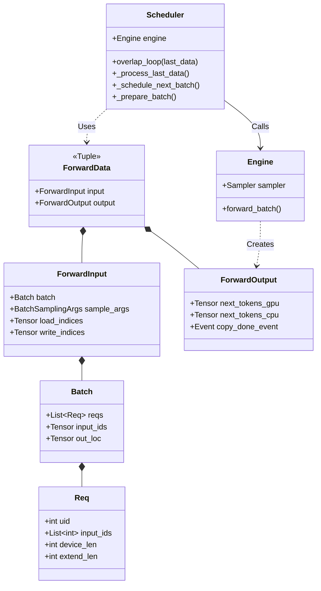
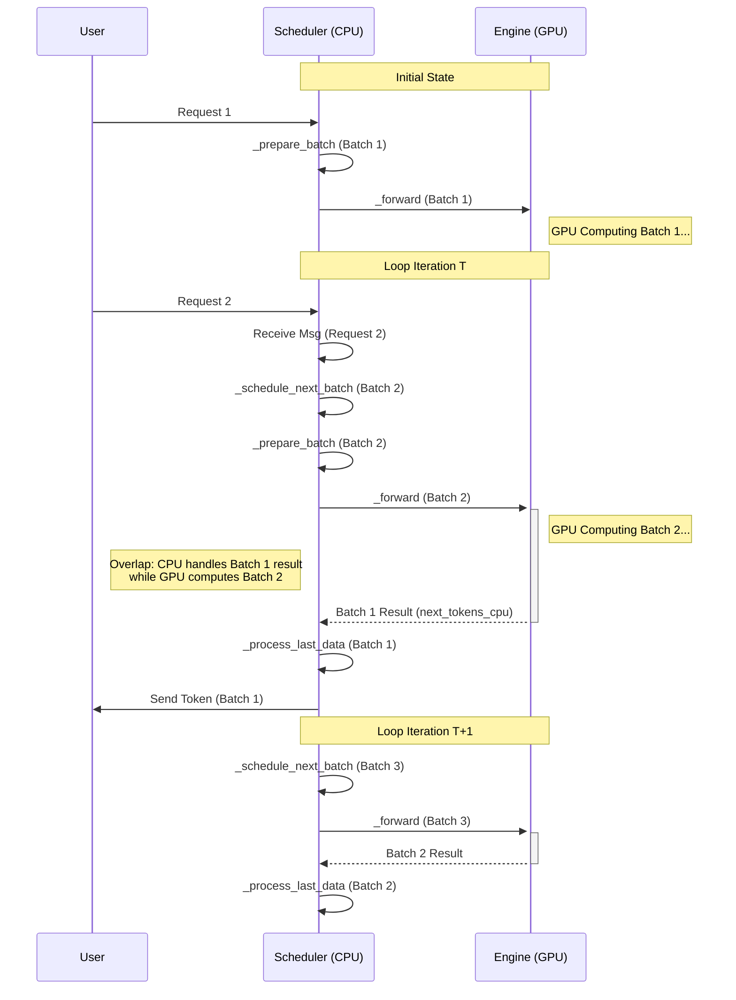

# Scheduler Overlap Logic Analysis

This document analyzes the `overlap_loop` mechanism in `python/minisgl/scheduler/scheduler.py`. This is the core engine loop designed to maximize GPU utilization by parallelizing CPU-bound tasks (data preparation, post-processing) with GPU-bound tasks (model forward pass).

## 1. Core Concept: Pipelined Execution

In a naive implementation, the loop would be serial:
`Prepare Data (CPU) -> Run Model (GPU) -> Process Result (CPU)`

This leaves the GPU idle during CPU phases and vice versa. `overlap_loop` changes this to a pipeline:

1. **Submit** Batch $N$ to GPU (Async).
2. **Process** results of Batch $N-1$ (CPU).
3. **Prepare** Batch $N+1$ (CPU).

## 2. Key Data Models

To facilitate this state passing between iterations, the code uses specific `NamedTuple` structures defined in `scheduler.py`.

### 2.1 Class Diagram (UML)



### 2.2 ForwardInput (Preparation)

Represents all data needed by the GPU to execute a forward pass. Created by `_prepare_batch` on the CPU.

| Field           | Type                | Description                                                           |
| :-------------- | :------------------ | :-------------------------------------------------------------------- |
| `batch`         | `Batch`             | Logical batch object containing Request objects (`Req`).              |
| `sample_args`   | `BatchSamplingArgs` | Metadata for the sampler (temperatures, top_p, etc.).                 |
| `load_indices`  | `Tensor`            | 1D indices mapping where to read input tokens from the KV Cache pool. |
| `write_indices` | `Tensor`            | 1D indices mapping where to write the generated _next_ tokens.        |

### 2.3 ForwardOutput (Result)

Represents the raw output from the GPU execution. Returned by `engine.forward_batch`.

| Field             | Type         | Description                                                               |
| :---------------- | :----------- | :------------------------------------------------------------------------ |
| `next_tokens_gpu` | `Tensor`     | The generated token IDs residing on VRAM.                                 |
| `next_tokens_cpu` | `Tensor`     | A copy of the token IDs moved to RAM (used for logic).                    |
| `copy_done_event` | `cuda.Event` | (Optional) Synchronization primitive to signal when the copy is complete. |

### 2.4 ForwardData (State Carrier)

A tuple combining the input and its corresponding output. This is the "token" passed from one loop iteration to the next.

```python
ForwardData = Tuple[ForwardInput, ForwardOutput]
```

---

## 3. The Overlap Loop Logic

### 3.1 Flowchart

```mermaid
flowchart TD
    Start([Start Loop Iteration])

    subgraph Input_State [Input: last_data]
    Note1[Result from Previous Loop<br/>Batch N-1]
    end

    Input_State --> MsgCheck

    subgraph CPU_Phase_1 [CPU: Message & Scheduling]
    MsgCheck{Has last_data or<br/>Running Requests?}
    MsgCheck -- No --> BlockWait[Blocking Receive Msg]
    MsgCheck -- Yes --> NonBlockWait[Non-Blocking Receive Msg]

    BlockWait --> ProcessMsg[Process New Requests]
    NonBlockWait --> ProcessMsg

    ProcessMsg --> Schedule[Schedule Next Batch (N)]
    Schedule --> Prepare[_prepare_batch<br/>Calculate Indices/Tables]
    end

    Prepare --> Launch

    subgraph GPU_Phase [GPU: Async Execution]
    Launch{Batch N Exists?}
    Launch -- Yes --> StreamCtx[Enter Engine Stream]
    StreamCtx --> Forward[_forward<br/>Submit Kernels to GPU]
    Forward --> OngoingData[Create ongoing_data<br/>(Batch N Input + Future Output)]
    Launch -- No --> NoOp[No Active Batch]
    end

    OngoingData --> ProcessLast
    NoOp --> ProcessLast

    subgraph CPU_Phase_2 [CPU: Post-Processing]
    ProcessLast[_process_last_data<br/>Handle Batch N-1]
    Note2[Decodes Token IDs<br/>Checks EOS/Length<br/>Frees Memory<br/>Sends Results to User]
    end

    ProcessLast --> Return([Return ongoing_data])

    style Note1 fill:#f9f,stroke:#333
    style Note2 fill:#f9f,stroke:#333
```

### 3.2 Step-by-Step Execution Breakdown

The `overlap_loop` function takes `last_data` as input and returns `ongoing_data`.

#### Step 1: Message Handling (CPU)

- **Goal:** Ingest new user requests (`UserMsg`) from the ZMQ socket.
- **Logic:**
  - If `last_data` is `None` AND no requests are running (`prefill` and `decode` managers are empty), the system enters **Blocking Mode** (sleeps until a request arrives).
  - Otherwise, it polls in **Non-Blocking Mode** to grab any available messages without stopping the pipeline.

#### Step 2: Scheduling Next Batch $N$ (CPU)

- **Goal:** Decide what runs _next_ on the GPU.
- **Logic:**
  - Calls `_schedule_next_batch`.
  - Priority: **Prefill** (New prompts) > **Decode** (Generating tokens).
  - Calls `_prepare_batch` to allocate memory pages, build Page Tables, and generate index tensors.
  - **Result:** `forward_input` (Batch $N$).

#### Step 3: Launching Forward Pass $N$ (GPU - Async)

- **Goal:** Kick off the GPU computation for Batch $N$.
- **Logic:**
  - If `forward_input` exists:
    - Enter `self.engine_stream_ctx` (ensures kernels run on the compute stream).
    - Call `self._forward(forward_input)` (see [Scheduler Forward Logic](scheduler_forward_logic.md)).
    - This submits the kernel launch commands to the driver. **It returns immediately**, without waiting for the GPU to finish.
  - **Result:** `ongoing_data` (contains the `forward_input` and the future `forward_output` handle).

#### Step 4: Processing Last Batch $N-1$ (CPU)

- **Goal:** While the GPU is busy with Batch $N$, the CPU handles the results of Batch $N-1$.
- **Logic:**
  - Calls `_process_last_data(last_data, ongoing_data)`.
  - **Wait:** If `copy_done` event exists, sync slightly to ensure `next_tokens_cpu` is ready.
  - **Decode:** Read integer IDs from `next_tokens_cpu`.
  - **Update:** Append tokens to request objects.
  - **Check:** Is the request finished (EOS or Max Length)?
    - If yes, free resources (KV Cache pages).
  - **Reply:** Send generated tokens back via ZMQ (`BatchTokenizerMsg`).
  - _Note:_ `ongoing_data` is passed here mainly to ensure we don't accidentally free resources for requests that are still running in the _current_ batch (edge cases).

## 4. Timeline View



## 5. Critical Code Sections

### The Loop Itself (`scheduler.py`)

```python
def overlap_loop(self, last_data: ForwardData | None) -> ForwardData | None:
    # 1. Receive Messages
    blocking = not (last_data or self.prefill_manager.runnable or self.decode_manager.runnable)
    for msg in self.receive_msg(blocking=blocking):
        self._process_one_msg(msg)

    # 2. Schedule & Prepare Next Batch
    forward_input = self._schedule_next_batch()

    # 3. Launch GPU (Async)
    ongoing_data = None
    if forward_input is not None:
        with self.engine_stream_ctx:
            # Returns immediately after launching kernels
            ongoing_data = (forward_input, self._forward(forward_input))

    # 4. Process Previous Results (Hiding Latency)
    self._process_last_data(last_data, ongoing_data)

    return ongoing_data
```

### Why `_process_last_data` needs `ongoing_data`?

In `_process_last_data`, we check for finished requests.

```python
# Release resources for finished requests
# Note: Must exclude requests that are currently running in ongoing_data
ongoing_reqs = ongoing_data[0].batch.reqs if ongoing_data else []
for req in self.finished_reqs.difference(ongoing_reqs):
    # Free KV Cache...
```

This prevents a race condition where a request might be marked "finished" logic-wise (e.g., hit max tokens) but is still physically executing a step in the GPU pipeline (rare in this specific architecture, but good safety practice).

